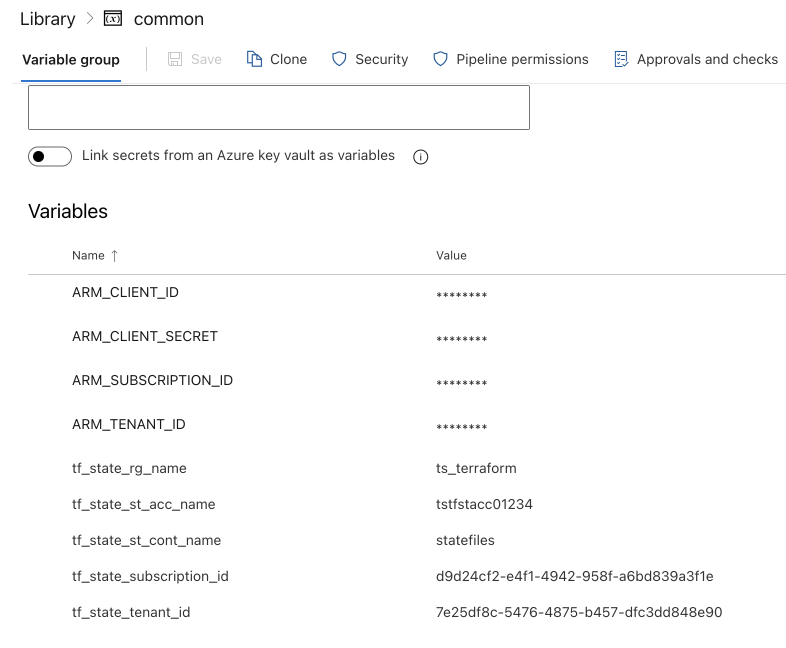

# Introduction

- This project contains few terraform resources ( for ex: resource group and container instance )
- There is ADO pipeline written ( use Azure DevOps to run Pipeline)
- Make sure to follow pre-requisites to create stroage account and service principal
- This would use remote modules.

# Pre-requisites
 - Create Service Prinicipal
 - Add all the details to 'common' group varialbe in ADO
 - Give contributor access to Service Principal
 - Create a storage account, since we store terraform statefile into storage account.
 - Storage account details, store them into 'COMMON' group variable.

  

 * ARM_CLIENT_ID
 * ARM_CLIENT_SECRET
 * ARM_TENANT_ID
 * ARM_SUBSCRIPTION_ID

 * tf_state_rg_name
 * tf_state_st_acc_name
 * tf_state_st_cont_name
 * tf_state_subscription_id
 * tf_state_tenant_id

# Folder Structure
- Modules - which contains modules of terraform
- Pipeline - this folder contains pipeline
- Terraform - this folder contains actual terraform project files ( main.tf, var.tf, provider.tf, backend.tf)

# Pipeline
- Pipeline contains 4 steps, terraform init, validte, plan, apply 
- Make sure to set env variables ( including terraform backend variables) - pls see pre-requisites for more info.
