# **Executing an Infrastructure Pipeline with Remote Modules to run Color Application**

# Introduction

- **What is ``Infra Pipeline``** ?

    An **``infrastructure pipeline``** refers to a set of automated processes and tools designed to manage, deploy, and maintain the underlying infrastructure components of a software application. This pipeline streamlines the provisioning and configuration of infrastructure resources, ensuring consistency and reliability in the deployment process. It typically includes stages such as infrastructure as code (IaC) definition, testing, deployment, and monitoring..

- This project contains few terraform resources ( for ex: resource group and container instance )
- There is ADO pipeline written ( use Azure DevOps to run Pipeline)
- Make sure to follow pre-requisites to create stroage account and service principal
- This would use remote modules.

# Pre-requisites
 - **Create Service Prinicipal.**
 - **Add all the details to 'common' group varialbe in ADO.**
 - **Give contributor access to Service Principal.**
 - **Create a storage account, since we store terraform statefile into storage account.**
 - **Storage account details, store them into ``COMMON`` group variable.**

  

 * ARM_CLIENT_ID
 * ARM_CLIENT_SECRET
 * ARM_TENANT_ID
 * ARM_SUBSCRIPTION_ID

 * tf_state_rg_name
 * tf_state_st_acc_name
 * tf_state_st_cont_name
 * tf_state_subscription_id
 * tf_state_tenant_id

# Folder Structure
- Modules - which contains modules of terraform
- Pipeline - this folder contains pipeline
- Terraform - this folder contains actual terraform project files ( main.tf, var.tf, provider.tf, backend.tf)

# Pipeline
- Pipeline contains 4 steps, terraform init, validte, plan, apply 
- Make sure to set env variables ( including terraform backend variables) - pls see pre-requisites for more info.

# Process

### 1. **First step to begin with , Open your VS CODE and do ``clone`` the repository .**

 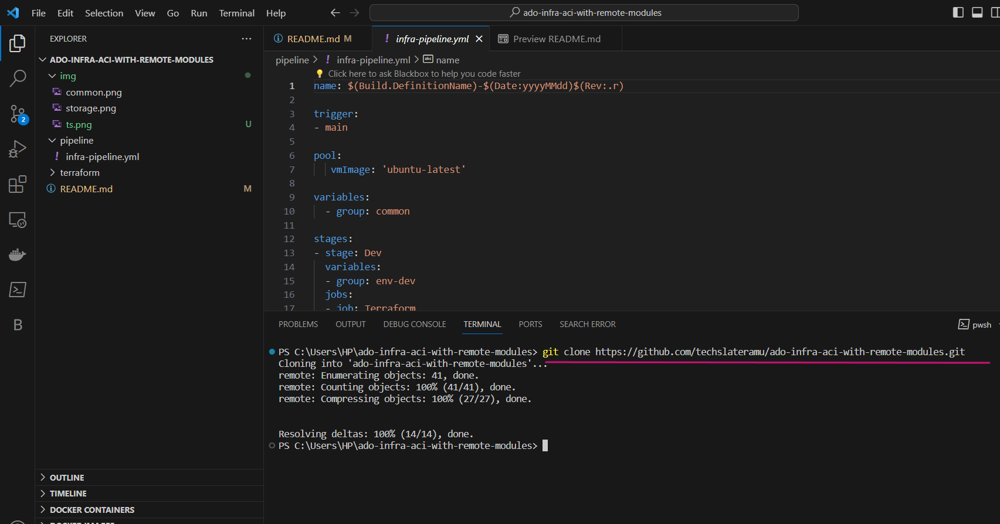

### 2. **Refer to the script properly and understand the process and steps.**

 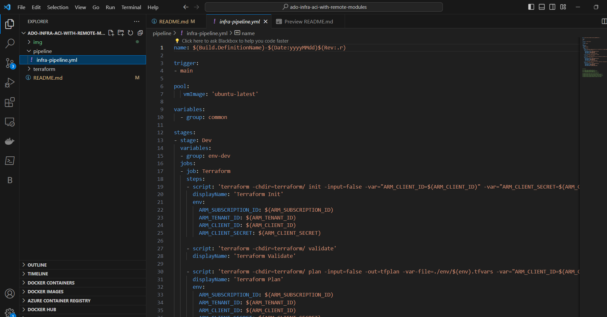 

### 3. **Now come back to https://dev.azure.com/ (Azure DevOps) and Import your repository here.**

 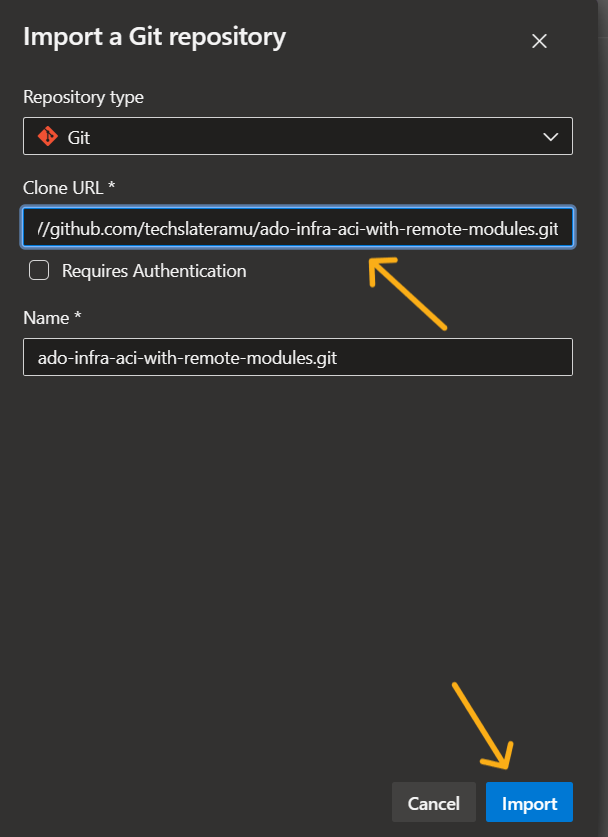   

### 4. Repository imported successfully , now lets just check whether mentioned group variables in the pipeline are created in Azure DevOps Library or not .

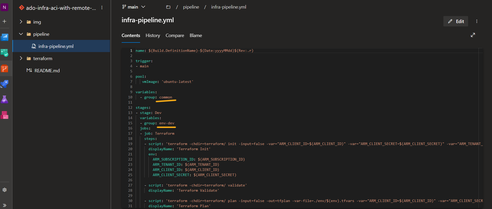

### 5. Let's go back to the ``Library`` and confirm the presence of group varaibles i.e, ``Common`` and ``env-dev``. Make sure that below , Resource Group , Storage Account and Container are created in portal and names as it is .

- tf_state_rg_name
- tf_state_st_acc_name
- tf_state_st_cont_name

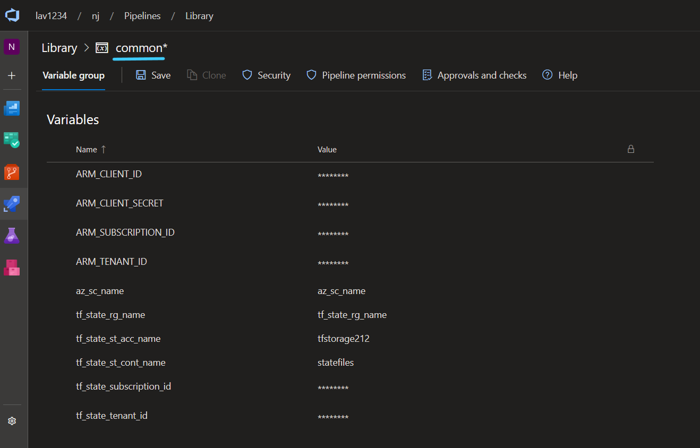

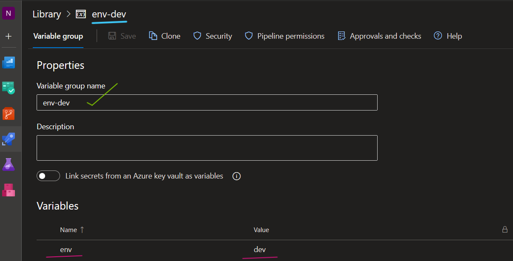

### 6. Now let's run the pipeline , Click on ``New Pipeline`` .

### 7. Select  ``Azure Repos Gits`` .

### 8. Select the Repository .

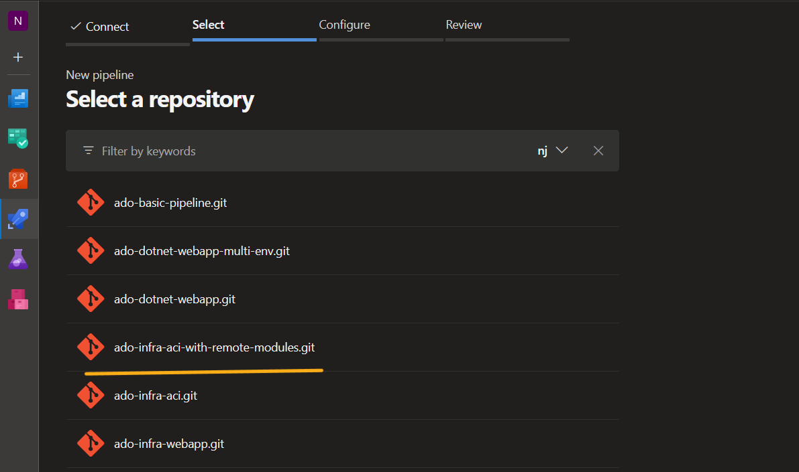

### 9. Click on ``Existing Azure Pipelines YAML file`` .

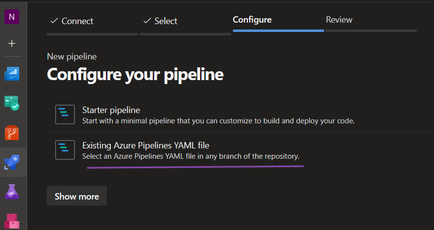

### 10. Select the Pipeline Path & Click on ``Continue`` .

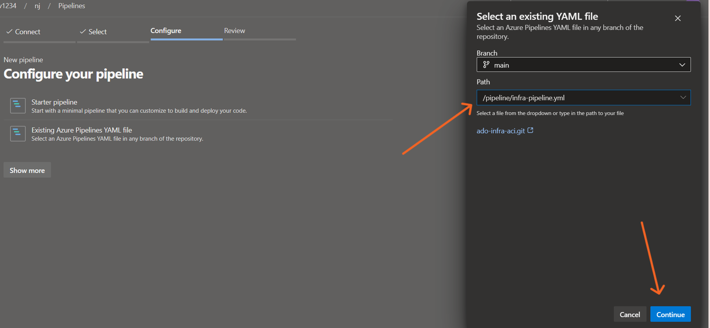

### 11.  Click on ``RUN`` .

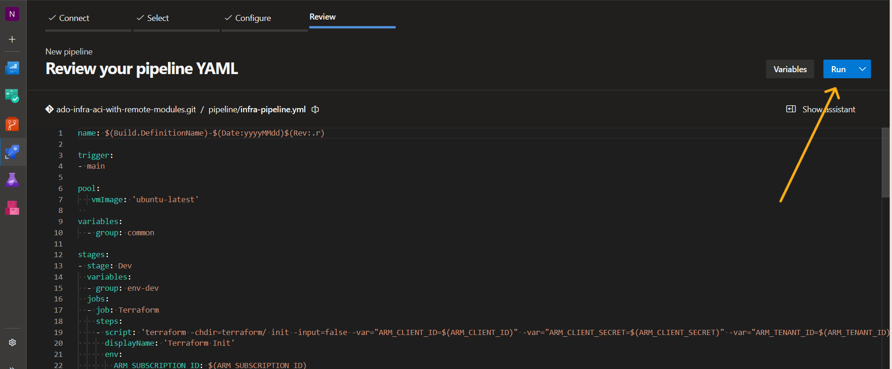

### 12. The pipeline has started to Run , Lets wait for sometime .

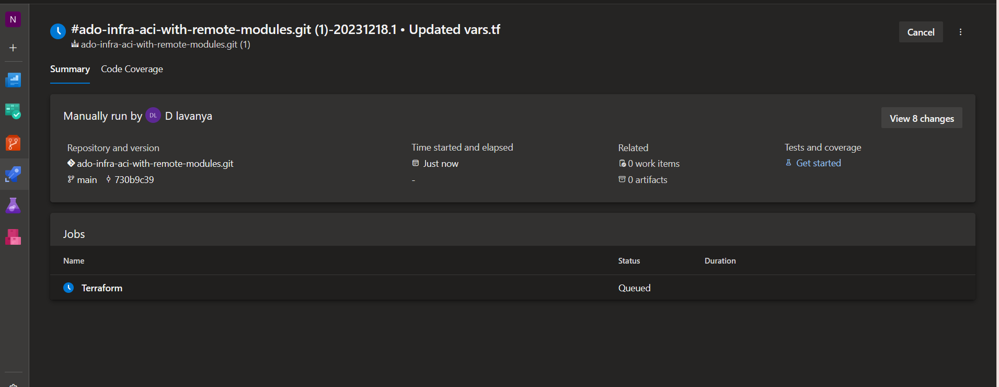

### 13. So, when the pipeline got initialised it will ask you to permit to access the Group Variables , you need to click on ``Permit`` for both the Group Variables .

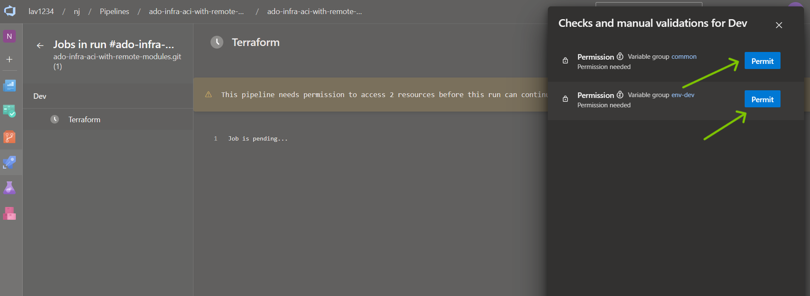

### 14. The Pipeline has run Sucessfully.

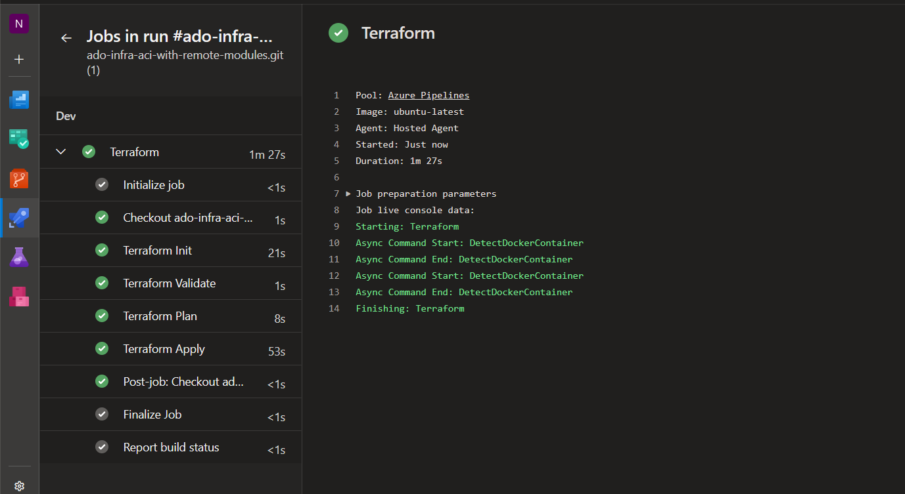

### 15. Now, Lets get back to the Azure Portal and see if our resources got created successfully and running. So both of our ``Resource group`` and ``Container Instance``created Sucessfully .

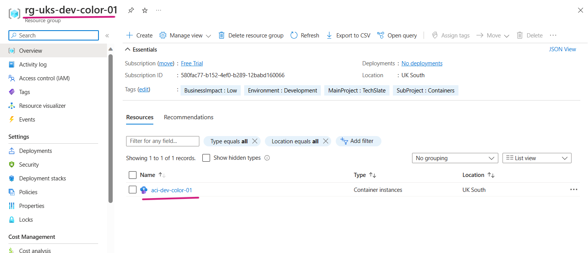

### 16. Lets's Open the Container Instance and Try to access the DNS .

### 16. Here its is , we can see the ``Color`` app is running Successfully!.

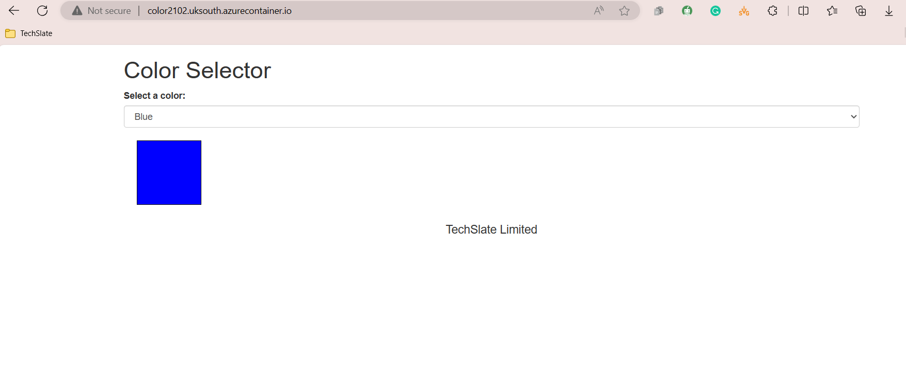

***